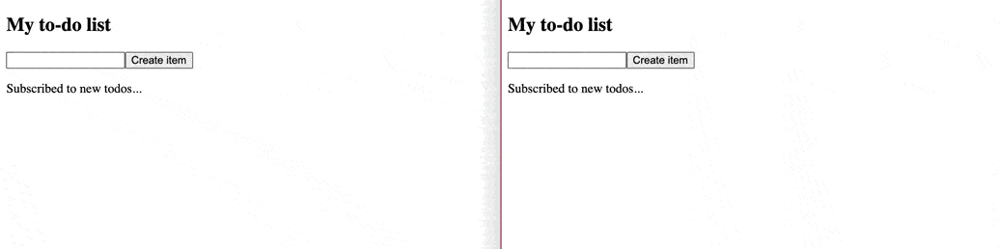

# To-do list example

This example demonstrates a basic to-do list application using Apollo Client and AWS AppSync. It supports various articles in the [Apollo docs](https://www.apollographql.com/docs/).

## Features:

* Authentication: API_KEY
* GraphQL schema:
```graphql
schema {
    query: Query
    mutation: Mutation
    subscription: Subscription
}

type Query {
    todo(id: String!): Todo
    todos: [Todo]
}

type Todo {
    id: String!
    description: String!
}

type Mutation {
    addTodo(description: String!): Todo
    updateTodo(id: String!, description: String!): Todo
}

type Subscription {
    onAddTodo: Todo
    @aws_subscribe(mutations: ["addTodo"])
}
```

* @apollo/client: 3.4.5
  


## Resources

* [apollographql / docs-examples](https://github.com/apollographql/docs-examples/tree/main/full-stack/todo-list)
* [awslabs / aws-mobile-appsync-sdk-js](https://github.com/awslabs/aws-mobile-appsync-sdk-js#using-authorization-and-subscription-links-with-apollo-client-v3-no-offline-support)